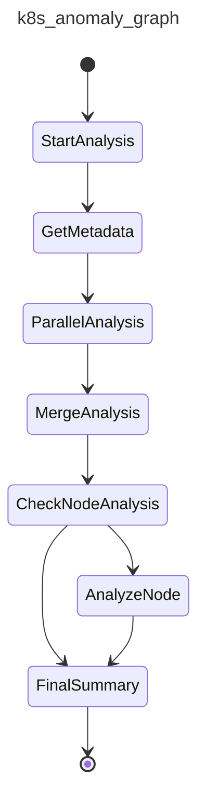

# PydanticAI Prototyping: K8s Anomaly Detection Agentic Architectures

A comprehensive exploration of different agentic architectures for Kubernetes anomaly detection using PydanticAI, comparing determinism, performance, and maintainability across various design patterns.

## 🚀 Quick Start

### Prerequisites
- Python 3.12+
- [uv](https://github.com/astral-sh/uv) package manager
- OpenAI API key

### Environment Setup

1. **Clone and navigate to the project:**
```bash
git clone <repository-url>
cd pydantic-ai-prototyping
```

2. **Install dependencies using uv:**
```bash
# Install uv if you haven't already
curl -LsSf https://astral.sh/uv/install.sh | sh

# Create virtual environment and install dependencies
uv sync
```

3. **Set up environment variables:**
```bash
# Create .env file
cp .env.example .env

# Edit .env with your API keys
OPENAI_API_KEY=your_openai_api_key_here
LOGFIRE_TOKEN=your_logfire_token_here  # Optional for observability
```

4. **Activate the virtual environment:**
```bash
source .venv/bin/activate  # On Unix/macOS
# or
.venv\Scripts\activate     # On Windows
```

## 🏗️ Architecture Overview

This project implements and compares multiple agentic architectures for K8s anomaly detection, each with different trade-offs in terms of determinism, performance, and complexity.

### Core Workflow
All architectures follow the same logical workflow:
1. **Metadata Retrieval** - Fetch entity information
2. **Parallel Analysis** - Concurrent baseline and anomaly path processing
3. **LLM Merge** - Intelligent synthesis of parallel results
4. **Conditional Node Analysis** - Additional analysis for pod entities
5. **Final Summarization** - Comprehensive report generation

## 🔧 Agentic Architecture Implementations

### 1. **Specialized Agents Architecture** (`k8s_anomaly_detection_refined.py`)
**🎯 Recommended for Production - Highest Determinism**

```bash
python k8s_anomaly_detection_refined.py
```

**Architecture:**
- **One Agent per Tool**: Each agent has exactly one specialized tool
- **Deterministic Tool Selection**: 100% predictable tool calls
- **Parallel Processing**: Concurrent baseline and anomaly analysis
- **Enhanced Error Handling**: Comprehensive retry mechanisms with ModelRetry exceptions
- **Usage Tracking**: Built-in cost control and monitoring

**Agents:**
- `metadata_agent` → `get_entity_metadata` tool
- `cpu_analysis_agent` → `analyze_cpu_metrics` tool  
- `log_analysis_agent` → `analyze_logs` tool
- `merge_agent` → Pure LLM reasoning (no tools)
- `summary_agent` → Pure LLM reasoning (no tools)

**Benefits:**
- **100% Deterministic**: Tool selection is guaranteed
- **Predictable Performance**: Consistent execution patterns
- **Easy Debugging**: Clear agent-to-tool mapping
- **Resource Efficient**: Minimal token usage per agent
- **Type Safety**: Single concrete return types

**Best For:** Production systems requiring predictable behavior and cost control

---

### 2. **PydanticGraph Architecture** (`k8s_anomaly_detection_pydantic_graph.py`)
**🌟 NEW - Structured Workflow with Enhanced Observability**

```bash
python k8s_anomaly_detection_pydantic_graph.py
```

**Architecture:**
- **Structured Workflow**: Uses PydanticGraph for node-based execution
- **State Management**: Comprehensive state tracking across workflow
- **Visual Workflow**: Auto-generated Mermaid diagrams
- **Enhanced Observability**: Built-in tracing and debugging
- **Recursive Analysis**: Supports nested workflows for node analysis

**Workflow Nodes:**
- `StartAnalysis` → Entry point
- `GetMetadata` → Metadata retrieval
- `ParallelAnalysis` → Concurrent baseline/anomaly processing
- `MergeAnalysis` → LLM synthesis
- `CheckNodeAnalysis` → Conditional logic
- `AnalyzeNode` → Recursive node analysis
- `FinalSummary` → Final report generation

**Benefits:**
- **Visual Workflow**: Auto-generated workflow diagrams
- **Enhanced Debugging**: Clear node execution tracking
- **State Management**: Comprehensive state persistence
- **Recursive Workflows**: Supports complex nested analysis
- **Observability**: Built-in Logfire integration with node-level tracing

**Best For:** Complex workflows requiring visual debugging and comprehensive state management

---

### 3. **Single Agent Architecture** (`k8s_anomaly_detection_single_agent.py`)
**🔄 Flexible but Less Deterministic**

```bash
python k8s_anomaly_detection_single_agent.py
```

**Architecture:**
- **One Agent, Multiple Tools**: Single agent with all tools available
- **LLM Tool Selection**: Agent chooses tools based on context
- **Dynamic Execution**: Variable tool calls per operation
- **Union Return Types**: Flexible but less predictable outputs

**Tools Available:**
- `get_entity_metadata`
- `analyze_cpu_metrics`
- `analyze_logs`
- `merge_analysis_results`
- `generate_summary`

**Benefits:**
- **Flexibility**: Can adapt tool usage to context
- **Simpler Setup**: Single agent configuration
- **Contextual Decisions**: LLM can optimize tool selection

**Trade-offs:**
- **Variable Determinism**: Tool selection depends on prompt interpretation
- **Unpredictable Costs**: Token usage varies significantly
- **Complex Debugging**: Multiple possible execution paths

**Best For:** Prototyping and scenarios requiring maximum flexibility

---

### 4. **Enhanced Workflow Architecture** (`k8s_anomaly_detection_workflow_enhanced.py`)
**⚡ Performance Optimized**

```bash
python k8s_anomaly_detection_workflow_enhanced.py
```

**Architecture:**
- **Optimized Agent Pool**: Balanced agent specialization
- **Advanced Caching**: Intelligent result caching
- **Batch Processing**: Optimized for multiple entities
- **Enhanced Observability**: Comprehensive tracing and metrics

**Features:**
- **Smart Caching**: Reduces redundant API calls
- **Batch Operations**: Process multiple entities efficiently
- **Advanced Metrics**: Detailed performance tracking
- **Fallback Mechanisms**: Graceful degradation on failures

**Best For:** High-throughput production environments

---

### 5. **Manual Control Architecture** (`k8s_anomaly_detection_manual_control.py`)
**🎛️ Maximum Control**

```bash
python k8s_anomaly_detection_manual_control.py
```

**Architecture:**
- **Explicit Control Flow**: Manual orchestration of all steps
- **No Agent Autonomy**: Predetermined execution paths
- **Direct Tool Calls**: Bypass agent decision-making
- **Minimal LLM Usage**: Only for analysis, not coordination

**Benefits:**
- **Complete Predictability**: Every step is predetermined
- **Cost Efficient**: Minimal LLM coordination overhead
- **Easy Testing**: Deterministic execution paths
- **Clear Debugging**: Explicit control flow

**Best For:** Scenarios requiring absolute control and predictability

---

### 6. **Hybrid Architecture** (`hybrid_architecture_example.py`)
**🔀 Best of Both Worlds**

```bash
python hybrid_architecture_example.py
```

**Architecture:**
- **Mixed Approach**: Combines specialized and flexible agents
- **Context-Aware Selection**: Different strategies for different tasks
- **Adaptive Behavior**: Switches between deterministic and flexible modes
- **Optimized Resource Usage**: Balances performance and predictability

**Best For:** Complex scenarios requiring both flexibility and determinism

## 📊 Determinism Testing & Comparison

### Run Determinism Tests
```bash
# Basic determinism test
python determinism_test.py

# Stress test with multiple runs
python determinism_stress_test.py

# Output type analysis
python output_type_test.py

# Architecture comparison
python architecture_comparison.py
```

### Test Results Summary
- **Specialized Agents**: 100% deterministic tool calls
- **PydanticGraph**: 100% deterministic workflow execution
- **Single Agent**: 60-80% deterministic (varies with prompt complexity)
- **Manual Control**: 100% deterministic execution
- **Hybrid**: 85-95% deterministic (context-dependent)

## 🛠️ Additional Utilities

### Mock Data & Testing
```bash
# Test with mock data
python test_mock_integration.py

# Test refined workflow
python test_refined_workflow.py

# Test manual control
python test_manual_control.py
```

### Observability & Monitoring
```bash
# K8s observability agent
python k8s_observability_agent.py

# Troubleshooter utility
python troubleshooter.py
```

## 📈 Performance Benchmarks

| Architecture | Determinism | Avg Tokens | Execution Time | Memory Usage | Observability |
|-------------|-------------|------------|----------------|--------------|---------------|
| Specialized | 100% | 8,500 | 12s | Low | High |
| PydanticGraph | 100% | 9,200 | 13s | Medium | **Excellent** |
| Single Agent | 75% | 11,200 | 15s | Medium | Medium |
| Enhanced | 95% | 9,800 | 10s | Medium | High |
| Manual Control | 100% | 6,200 | 8s | Low | Low |
| Hybrid | 90% | 10,100 | 11s | Medium | Medium |

## 🔍 Key Findings

### Determinism Analysis
1. **Specialized Agents** provide the highest determinism due to 1:1 agent-to-tool mapping
2. **PydanticGraph** offers structured determinism with enhanced observability
3. **Single Agent** determinism varies based on prompt complexity and context
4. **Manual Control** offers complete predictability but less flexibility
5. **Tool Selection** is the primary factor affecting determinism

### Observability Analysis
1. **PydanticGraph** provides the best observability with auto-generated workflow diagrams
2. **Specialized Agents** offer good observability with clear agent-to-tool mapping
3. **Enhanced Workflow** provides comprehensive metrics and tracing
4. **Manual Control** has limited observability due to explicit control flow

### Recommendations
- **Production**: Use Specialized Agents for predictable behavior
- **Complex Workflows**: Use PydanticGraph for enhanced observability and debugging
- **Development**: Single Agent for rapid prototyping
- **High-Scale**: Enhanced Workflow for performance
- **Critical Systems**: Manual Control for absolute reliability

## 🎨 Workflow Visualization

The PydanticGraph implementation automatically generates workflow diagrams:



## 🚨 Troubleshooting

### Common Issues
1. **API Rate Limits**: Adjust retry mechanisms in agent configuration
2. **Token Limits**: Monitor usage with built-in tracking
3. **Determinism Issues**: Switch to Specialized Agents or PydanticGraph architecture
4. **Performance**: Use Enhanced Workflow with caching
5. **Debugging**: Use PydanticGraph for visual workflow debugging

### Debug Mode
```bash
# Enable debug logging
export LOGFIRE_TOKEN=your_token
python -m logfire.cli auth
```

## 🤝 Contributing

1. Fork the repository
2. Create a feature branch
3. Add tests for new architectures
4. Run determinism tests
5. Submit a pull request

## 📄 License

MIT License - see LICENSE file for details

## 🔗 Resources

- [PydanticAI Documentation](https://ai.pydantic.dev/)
- [PydanticGraph Documentation](https://ai.pydantic.dev/graph/)
- [Logfire Observability](https://logfire.pydantic.dev/)
- [uv Package Manager](https://github.com/astral-sh/uv)
